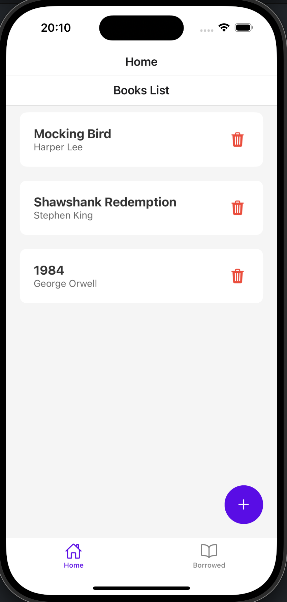
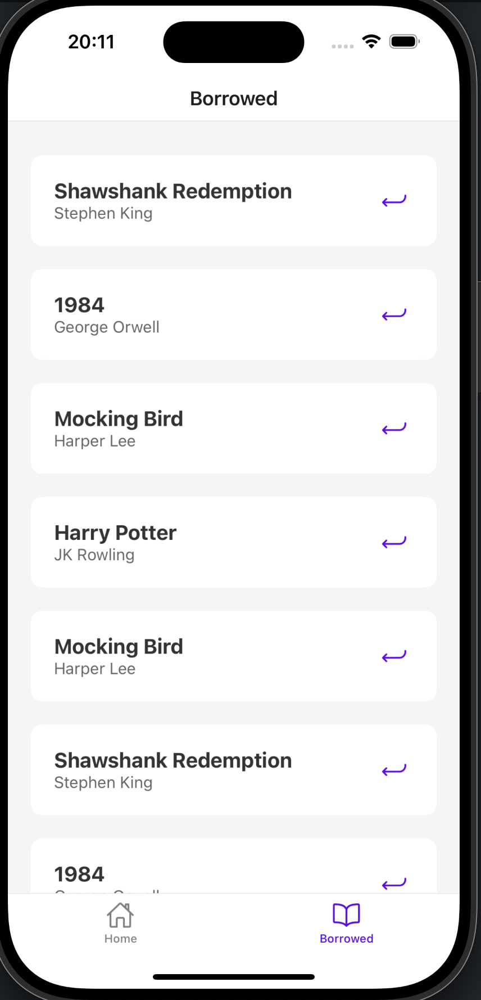

---

# 📚 BookApp

A sleek and intuitive book management app built with React Native. This app allows users to explore a collection of books, borrow them, and keep track of borrowed books. With a clean and modern UI, BookApp provides a seamless experience for book lovers.

## ✨ Features

- **📖 Book Collection**: Browse through a list of available books with details including title, author, rating, and a brief summary.
- **🛠️ Borrowing Management**: Borrow books easily from the collection, with restrictions on borrowing the same book multiple times.
- **📚 Borrowed Books**: View a list of all borrowed books and return them when finished.
- **🌈 Dark & Modern UI**: Beautiful, minimalistic interface with clean, readable typography.
- **🛠️ Smooth Navigation**: Intuitive navigation with stack and tab navigators for a seamless user experience.

## 🛠️ Technologies Used

- **React Native**: A JavaScript framework for building native mobile apps.
- **Expo**: A platform for developing and deploying React Native applications.
- **React Navigation**: For smooth stack and tab-based navigation between screens.
- **Firebase Firestore**: A cloud-based NoSQL database to store and retrieve book data in real-time.
- **Custom Styling**: For a modern and clean user interface.

## 📸 Screenshots

### Books List Screen


### Book Detail Screen


### Borrowed Books Screen



## 🚀 Getting Started

Follow these steps to get the project up and running locally.

### Prerequisites

- **Node.js**: Recommended version >= 16.0.
- **npm** or **Yarn**: Node package managers.
- **Expo CLI**: Run the following command to install:

```bash
npm install -g expo-cli
```

### Firebase Setup

1. Go to the [Firebase Console](https://console.firebase.google.com/) and create a new project (or use an existing one).
2. Add a new Web app to your Firebase project and follow the instructions. Once created, you will receive a Firebase configuration object.
3. Replace the `firebaseConfig` in your `firebaseConfig.js` file with your Firebase configuration details:

    ```javascript
    // firebaseConfig.js
    import { initializeApp } from 'firebase/app';
    import { getFirestore } from 'firebase/firestore';

    const firebaseConfig = {
      apiKey: "YOUR_API_KEY",
      authDomain: "YOUR_AUTH_DOMAIN",
      projectId: "YOUR_PROJECT_ID",
      storageBucket: "YOUR_STORAGE_BUCKET",
      messagingSenderId: "YOUR_MESSAGING_SENDER_ID",
      appId: "YOUR_APP_ID",
      measurementId: "YOUR_MEASUREMENT_ID"
    };

    // Initialize Firebase
    const app = initializeApp(firebaseConfig);
    export const db = getFirestore(app);
    ```

4. Set up Firestore in the Firebase Console:
   - In the Firebase Console, go to **Firestore Database** and click **Create Database**.
   - Choose the desired security rules and location to create the database.
   - Create two collections:
     - `books`: For storing the list of available books.
     - `borrowedBooks`: For storing borrowed book data.

### Installation

1. Clone the repository:

    ```bash
    git clone https://github.com/Qusai007/BookApp.git
    ```

2. Navigate to the project directory:

    ```bash
    cd BookApp
    ```

3. Install dependencies:

    Using npm:

    ```bash
    npm install
    ```

    Or using Yarn:

    ```bash
    yarn install
    ```

### Running the App

To run the app in the development environment:

1. Start Expo:

    ```bash
    npx expo start
    ```

2. Run on Emulator or Device:

    - Use the Expo Go app to scan the QR code and run it on your physical device.
    - Alternatively, run on an Android/iOS simulator through the Expo Developer Tools.

## 📂 Project Structure

```
.
├── assets                  # Images and media files
├── navigation              # Contains navigation setup (TabNavigator, StackNavigator)
├── screens                 # All screen components (BooksListScreen, BookDetailScreen, BorrowedScreen, etc.)
├── firebaseConfig.js       # Firebase configuration and initialization
├── App.js                  # Main application entry point
├── package.json            # Dependencies and project scripts
└── README.md               # Project documentation
```

## 🤝 Contributing

Contributions are welcome! Please follow these steps:

1. Fork the repository.
2. Create a new branch (`feature-name`).
3. Commit your changes (`git commit -m "Add some feature"`).
4. Push to the branch (`git push origin feature-name`).
5. Open a pull request.

## 📄 License

This project is licensed under the MIT License.

## 💬 Connect

- **GitHub**: [@Qusai007](https://github.com/Qusai007)
- **LinkedIn**: [Qusai Johar](https://www.linkedin.com/in/qusai-johar/)

Feel free to share your feedback, ideas, or report bugs!

## 🚀 Quick Commands

| Task                    | Command                     |
|-------------------------|-----------------------------|
| Clone Repository        | `git clone <repo-url>`      |
| Install Dependencies    | `npm install` or `yarn`     |
| Start Development Server| `expo start`                |
| Lint the Code           | `npm run lint` (optional)   |

Enjoy managing your books with a clean and modern app! 📚🎉

--- 